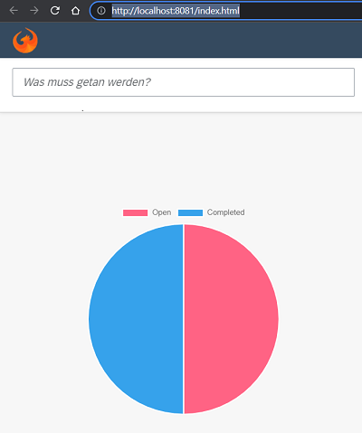

# Add a PieChart into the OpenUI5 Sample App

- Use this [.devcontainer](https://github.com/draschke/add-a-piechart-into-the-openui5-sample-app/tree/main/.devcontainer) and ***no additional installations*** are necessary for this exercise!

## Kick off development

Follow the instructions from the great [technical article](https://blogs.sap.com/2021/11/15/using-npm-packages-in-ui5-without-shims/?source=email-global-notification-bp-new-in-tag-followed) written by Peter Muessig

Step 1: Prepare your environment

```bash
git clone https://github.com/SAP/openui5-sample-app.git
cd openui5-sample-app
npm install
```

- Check for updates and update the package.json.

```bash
node ➜ /workspaces/openui5-sample-app (master ✗)
$ npm install -g npm-check-updates 
$ ncu -u
```

- Run the application with the following command

```bash
ui5 serve -o index.html
```

Step 2: Configure the ui5-tooling-modules extensions and add the livereload middleware

```bash
npm install ui5-tooling-modules --save-dev
npm install ui5-middleware-livereload --save-dev
```

- Open the ui5.yaml and add the following lines

- ui5.yaml

```yaml
builder:
  customTasks:
    - name: ui5-tooling-modules-task
      afterTask: replaceVersion
server:
  customMiddleware:
    - name: ui5-tooling-modules-middleware
      afterMiddleware: compression
    - name: ui5-middleware-livereload
      afterMiddleware: compression
      configuration:
        extraExts: "xml,json,properties"
        path: "webapp"

```

Step 3: Add Chart.js to the project

```bash
node ➜ /workspaces/openui5-sample-app (master ✗)
$ npm install chart.js --save-dev
```

Create a custom control for the PieChart integration into UI5:
(Create a new folder control and with a new PieChart.js file)
[webapp/control/PieChart.js](https://github.com/draschke/add-a-piechart-into-the-openui5-sample-app/blob/main/webapp/control/PieChart.js)

- Use the Custom Control in your App.view

```xml
<mvc:View xmlns:mvc="sap.ui.core.mvc" 
	xmlns:layout="sap.ui.layout"
	xmlns:cc="sap.ui.demo.todo.control"
	... />
	[...]
	<f:DynamicPage>
		[...]
		<f:content>
			<layout:VerticalLayout>
				<List ... />
				<cc:PieChart todos="{/todos}"/>
			</layout:VerticalLayout>
		</f:content>
		[...]
	</f:DynamicPage>
	[...]
</mvc:View>
```

Voilá, now you will see the PieChart!

Bonus Step 5: Building your project

After the build completed, inspect the “dist” folder and you can find a file called “chart.js.js”:

dist/resources/chart.js.js

```yaml
openui5-sample-app
├── dist
  ├── resources
    ├── chart.js.js       <-- the custom bundle for Chart.js
    ...
    └── ui5loaader.js
  ...
  └── manifest.json
...
└── ui5.yaml
```


