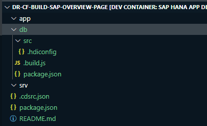
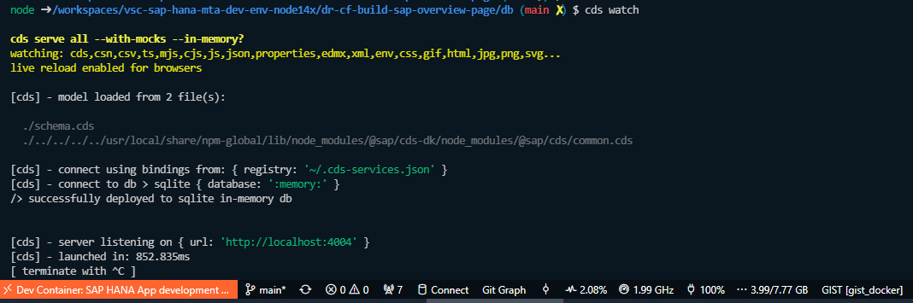
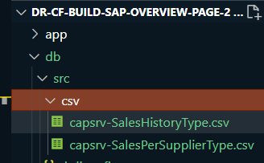
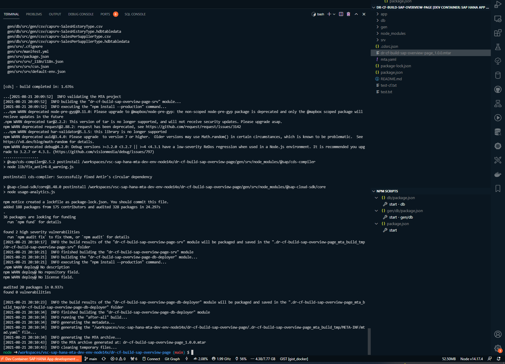
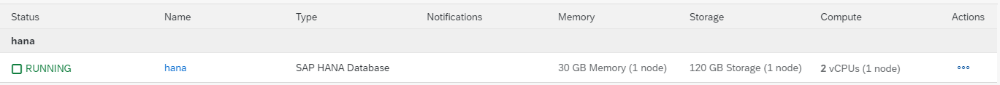
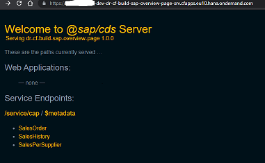
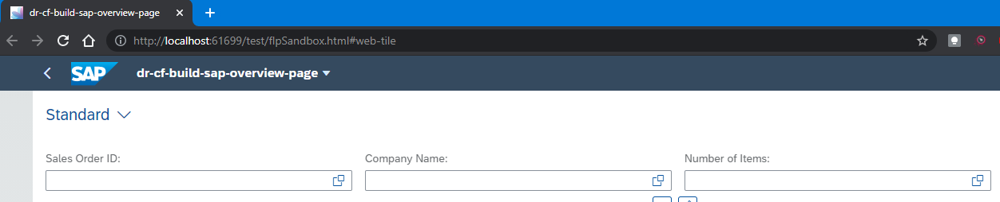
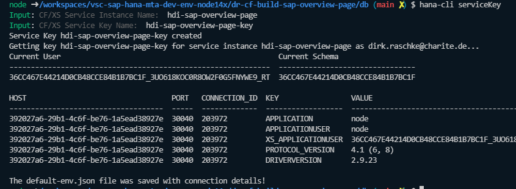
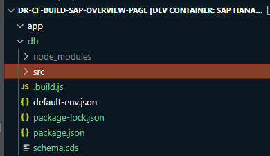

# Build SAP Overview Page using SAP HANA Cloud & SAP CAP service annotations in Visual (VS) Code

- [Build SAP Overview Page in Visual VS Code](https://Blogs-SAP-Com/2021/08/05/build-sap-overview-page-using-sap-hana-cloud-sap-cap-service-annotations-in-visual-vs-code/?source=social-Global-sap-developers-LINKEDIN_COMPANY-MarketingCampaign-Developers-SAPHANA-spr-5320082427&campaigncode=CRM-XB21-MKT-DGEALL) with this [VS Dev Container](https://github.com/draschke/vsc-sap-hana-mta-dev-env-node14x/tree/main/.devcontainer)

- If you use this [VS Dev Container](https://github.com/draschke/vsc-sap-hana-mta-dev-env-node14x/tree/main/.devcontainer) you can follow all the steps ***without having to install any further program***. This walkthrough only provides my additional quidance for this awesome :thumbsup: tutorial from SaiNithesh Gajula.

## Preparations

- Use only the mentioned [VS Dev Container](https://github.com/draschke/vsc-sap-hana-mta-dev-env-node14x/tree/main/.devcontainer) and ***no installations*** are necessary!

## Project development

Step 3 : Select CAP Project and click on Next until Step 6

```bash
node ➜ /dr-cf-build-sap-overview-page/
$ npm install
```

Step 7: hana-cli createModule

```bash
node ➜ /dr-cf-build-sap-overview-page/
$ hana-cli createModule
```

After executing the command it looks like this  



Step 8: Create the data model cds ***schema.cds*** under db layer.

```bash
node ➜ /dr-cf-build-sap-overview-page/db
$ create file schema.cds
```

Step 9: Create a CDS service ***capfesrv.cds*** in srv.

Step 10: Now create annotation file under srv layer named as ***ovpcapfeannotation.cds***.

Step 11: Using ***cds watch*** we can run the server and can the observe the logs in the terminal according to the development.

```bash
node ➜ /dr-cf-build-sap-overview-page/db
$ cds watch
```



Step 12: Let’s us check the metadata based on the service and annotations

```html
http://localhost:4005/service/cap/$metadata
```

Step 13: Add csv files under ***db/csv*** naming as namespace-entity.csv  



```html
http://localhost:4005/service/cap/SalesHistory?$top=11
```

Step 14: Update the ***package.json*** with hana configurations & devDependencies.

Install v2-proxy-adapter

```bash
node ➜ /dr-cf-build-sap-overview-page/ 
$ npm i @sap/cds-odata-v2-adapter-proxy
```

Change the "deploy-format"

```js
package.json
"deploy-format": "sql" --> "deploy-format": "hdbtable"
```

Step 15: To create V2 will ***add server.js*** odata v2 proxy using npm i @sap/cds-odata-v2-adapter-proxy

Add server.js

```js
"use strict";

const cds = require("@sap/cds");
const proxy = require("@sap/cds-odata-v2-adapter-proxy");

cds.on("bootstrap", app => app.use(proxy()));

module.exports = cds.server;
```

Step 16: Add ***node version*** in the package.json.

```js
    "engines": {
        "node": ">=14"
    },
```

Step 17: Now generate and ***mta*** file using cds add mta.

```bash
node ➜ /dr-cf-build-sap-overview-page/ 
$ cds add mta
```

Step 18: Execute ***cds build***

```bash
node ➜ /dr-cf-build-sap-overview-page/ 
$ cds build
```


```html
http://localhost:4005/service/cap/SalesHistory?$top=11
```

Step 19: Now let us ***login*** to SAP Cloud Foundry.

```bash
cf login -a https://api.cf.eu10.hana.ondemand.com -u email@ -p xxx --skip-ssl-validation
```

Step 20: ***Build the mtar*** file using mbt build -t ./

```bash
mbt build -t ./
```



Check for your SAP HANA DB ***it's up and running***! In my case the HANA DB was more times down and it took me a lot of time to start it again. :unamused:



Step 21: ***Deploy*** the app to BTP

```bash
cf deploy dr-cf-build-sap-overview-page_1.0.0.mtar
```

After Deployment  


Step 22: Now we can see the cap service is available to use both in v4 & v2 version

Check for the ****different OData versions**** in BTP

```link
metadata
https://xxxxx-dev-dr-cf-build-sap-overview-page-srv.cfapps.eu10.hana.ondemand.com/v2/service/cap/$metadata

https://xxxxx-dev-dr-cf-build-sap-overview-page-srv.cfapps.eu10.hana.ondemand.com/service/cap/$metadata
```

```link
data
https://xxxxx-dev-dr-cf-build-sap-overview-page-srv.cfapps.eu10.hana.ondemand.com/v2/service/cap/SalesHistory?$top=11

https://xxxxx-dev-dr-cf-build-sap-overview-page-srv.cfapps.eu10.hana.ondemand.com/v2/service/cap/SalesHistory?$top=11
--> its working, can see the data! :)
```

Step 23: Now let us create SAP Fiori Elements. Press F1 and start typing and select >***Fiori: Open Application Generator***. Choose Overview Page and click Next.

Step 24: Choose Connect to an OData Service under ***Data Source & Service Selection***

Step 25: Provide the ***oData V2 CAP service*** and click Next.

Step 26: Select the ***SalesOrder*** for Filter entity and click on Next.

Step 27: Now let’s run the application, right click on the project, and choose ***Preview Application***.

```bash
npm run start
```

Step 28: You can see empty screen with filters.



Step 29: Lets ***add cards now in manifest.json*** and change ***enableLiveFilter to false***. So that Go action will get enabled.

web/webapp/manifest.json

```bash
"enableLiveFilter": false,
```

Step 30: Reload the app, we can the charts get rendered based on the annotations which we created earlier

Added the two cards in manifest.json file
web/webapp/manifest.json

```json
  "sap.ovp": {
    "globalFilterModel": "mainService",
    "globalFilterEntityType": "SalesOrder",
    "containerLayout": "resizable",
    "enableLiveFilter": false,
    "considerAnalyticalParameters": false,
    "cards": {
      "donutCard": {
        "model": "mainService",
        "template": "sap.ovp.cards.charts.analytical",
        "settings": {
          "title": "Donut Chart",
          "entitySet": "SalesPerSupplier",
          "chartAnnotationPath": "com.sap.vocabularies.UI.v1.Chart#donut",
          "presentationAnnotationPath": "com.sap.vocabularies.UI.v1.PresentationVariant",
          "dataPointAnnotationPath": "com.sap.vocabularies.UI.v1.DataPoint#GrossAmountInCompanyCurrency",
          "idenfiticationAnnotationPath": "com.sap.vocabularies.UI.v1.Identification",
          "chartProperties": {
            "plotArea": {
              "dataLabel": {
                "type": "percentage"
              }
            }
          }
        }
      },
      "lineCard": {
        "model": "mainService",
        "template": "sap.ovp.cards.charts.analytical",
        "settings": {
          "title": "Line Chart",
          "entitySet": "SalesHistory",
          "chartAnnotationPath": "com.sap.vocabularies.UI.v1.Chart#Line",
          "presentationAnnotationPath": "com.sap.vocabularies.UI.v1.PresentationVariant",
          "dataPointAnnotationPath": "com.sap.vocabularies.UI.v1.DataPoint#GrossAmountInCompanyCurrency",
          "idenfiticationAnnotationPath": "com.sap.vocabularies.UI.v1.Identification"
        }
      }
    }
  }
```

For the moment I'm not able to see the two charts. :disappointed:
If you know why, please let me know!

### Additional note for connecting hdi container

You'll need the default-env.json file (credentials for connecting the hdi container).  
Get the default-env.json file (credentials) by running hana-cli serviceKey

```bash
node ➜ /dr-cf-build-sap-overview-page (main) 
$ hana-cli serviceKey
Input: CF/XS Service Instance Name:  dr-cf-build-sap-overview-page-db
Input: CF/XS Service Key Name:  dr-cf-build-sap-overview-page-db-key
Service Key dr-cf-build-sap-overview-page-db-key created

Output:
The default-env.json file was saved with connection details!
```



Put the default-env.json file in the right modul or on root.


Check the connection, by running hana-cli status

```bash
node ➜ /dr-cf-build-sap-overview-page/db (main ✗) $ hana-cli status
Using Connection Configuration loaded via ../default-env.json 
```

Now you are able to look for any db object

```bash
$ hana-cli tables 01194FD1C37145A9801EF50C4EAECFE4
Using Connection Configuration loaded via default-env.json 

SCHEMA_NAME                       TABLE_NAME                   TABLE_OID  COMMENTS
--------------------------------  ---------------------------  ---------  --------
01194FD1C37145A9801EF50C4EAECFE4  CAPSRV_SALESHISTORYTYPE      161480     null    
01194FD1C37145A9801EF50C4EAECFE4  CAPSRV_SALESORDERTYPE        161497     null    
01194FD1C37145A9801EF50C4EAECFE4  CAPSRV_SALESPERSUPPLIERTYPE  161511     null
```
