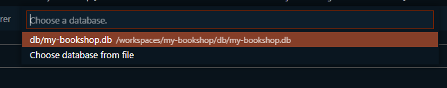
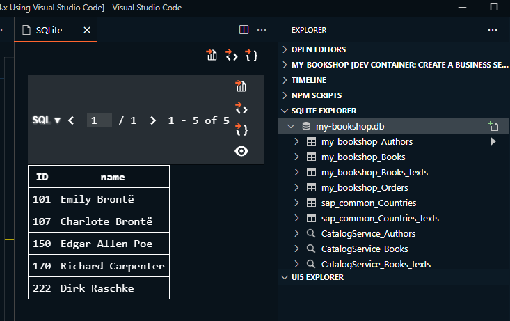
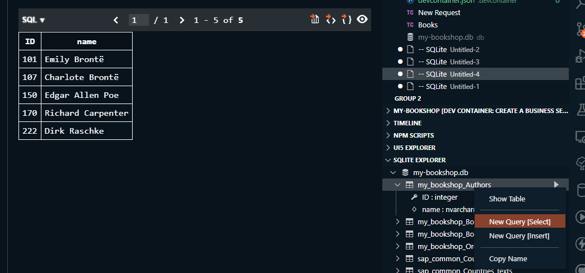
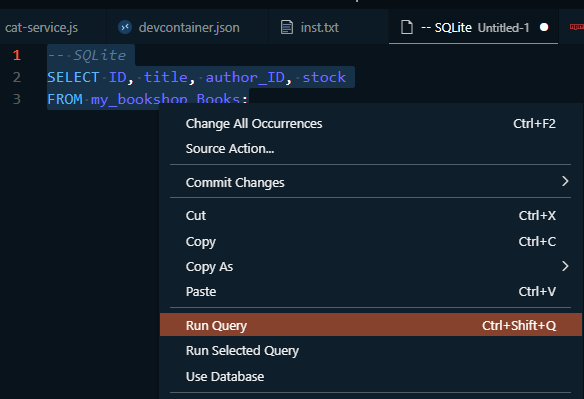
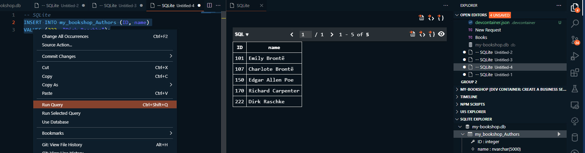
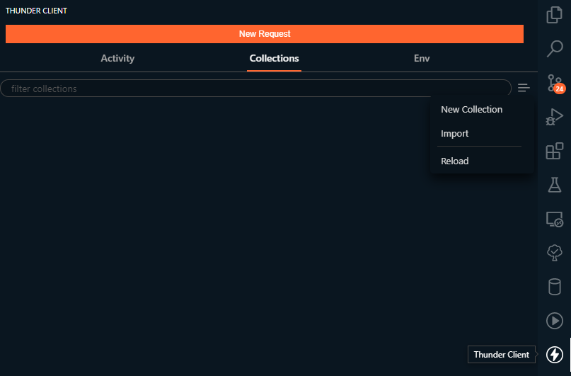
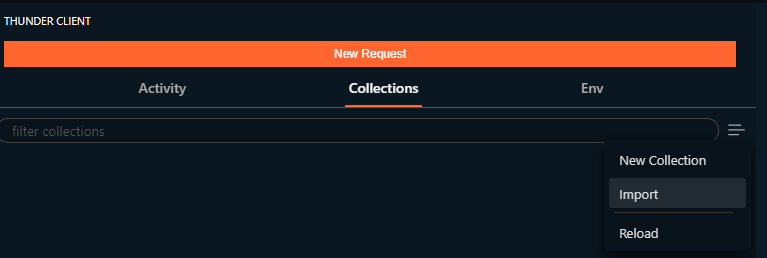
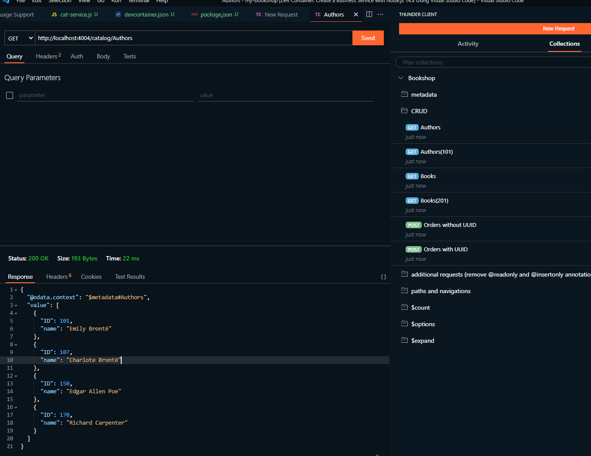
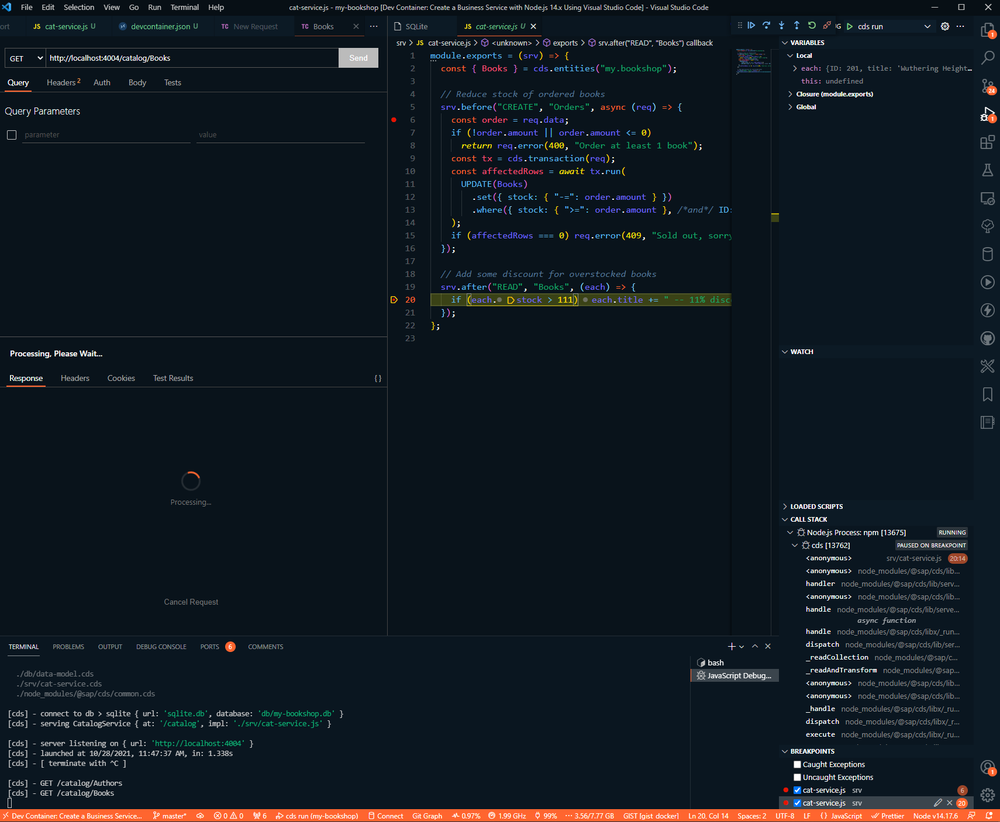

# Create an OData service with Node.js, SQLite, Thunder Client by using CAP with VS Code

 In this exercise I am following the tutorial from  [developers.sap.com](https://developers.sap.com/tutorials/cp-apm-nodejs-create-service.html). Following this SAP developer tutorial, you will learn more useful things in this blog about the app development with SQLite and Thunder Client (like Postman). I recommend using this [.devcontainer](https://github.com/draschke/my-bookshop/tree/master/.devcontainer) and you won't have to install any additional programs.
 If you have questions for setting up a DevContainer, you can follow all the steps already explained in this documentation [VS Code Dev Container for SAP HANA App development](https://draschke.github.io/vsc-sap-hana-mta-dev-env-node14x/).

## Preparations

- Use this [.devcontainer](https://github.com/draschke/my-bookshop/tree/master/.devcontainer) and ***no additional installations*** are necessary for this exercise!

## Kick off development

Follow the instruction from the referenced [tutorial](https://developers.sap.com/tutorials/cp-apm-nodejs-create-service.html).

Step 1: Set up local development environment and Step 2: Install Visual Studio Code extension

Use the VS Code Dev Container as mentioned above.

Step 3: Start project

```bash
node ➜ /workspaces/my-bookshop (master ✗)
$ npm i
```

If you like, check for updates and update the package.json.

```bash
node ➜ /workspaces/my-bookshop (master ✗)
$ npm install -g npm-check-updates 
$ ncu -u
output looks like: @sap/cds  ^5.5.4  →  ^5.5.5
```

Install your npms again, if necessary.

```bash
node ➜ /workspaces/my-bookshop (master ✗)
$ npm i
$ npm audit fix
```

Start watching you changes.

```bash
node ➜ /workspaces/my-bookshop (master ✗)
$ cds watch
```

Step 4: Define your first service --> Step 8: Add persistent database

Follow alle the steps from 4 to 8 of the [tutorial](https://developers.sap.com/tutorials/cp-apm-nodejs-create-service.html).

After you have finished all the steps from the tutorial, comes the nice interesting part about **SQLite**.
To make the work and steps with SQLite more easy I took some pictures.

Click "F1" and search for "SQLite: Open Database" and look for your bookshop.db.



Then open the "SQLITE EXPLORER" on the side bar.



Select the tables.



Execute the Select statement by marking the sql statement and clicking "Run Query"



Insert records in the tables.



Step 9: Test generic handlers with Thunder Client and not Postman

Now comes the next useful part. We don't have to leave VS Code. Instead of Postman we'll use the already installed **Thunder Client** extension. (if you use the recommended .devcontainer)

Open **Thunder Client** by clicking the "F1" button and search for "View: Show Thunder Client" or use the lightning icon on the side (Activity Bar).



Import your [postman.json](https://raw.githubusercontent.com/SAPDocuments/Tutorials/master/tutorials/cp-apm-nodejs-create-service/postman.json) file here:



Execute the requests



Now you can debug and test your app without leaving VS Code.



### Voilà, now you have learned, how to handle your requests within VS Code with **Thunder Client** and how you can use  **SQLite** instead of HANA DB at the beginning of your development
