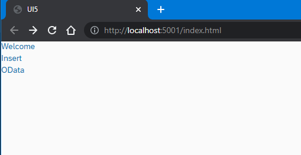

# Deploy a simple Node.js app to XSA platform by leverage Visual VS Code Dev Container

I suspect that the SAP WebIDE will no longer supported with new features for on-premise sytems, so we've to set up our own development environment and know how to handle all the development steps locally in our own IDE. In this exercise I will follow the deployment steps for a simple Node.js app, which that are described in this [SAP-Guide - Deploy a Node.js Hello-World Application using the XS CLI](https://help.sap.com/viewer/400066065a1b46cf91df0ab436404ddc/2.0.02/en-US/0919e1cbd20646aead930a5743cfa7e1.html). I love to leverage VS Code and that's why I'm going to show how to do this with the VS Dev Containers.

You can follow all my steps with this [VS Dev Container for Node.js 12x](https://github.com/draschke/tree/main/.devcontainer)

## Preparations

- Use Node.js 12.x for this sample app [VS Dev Container](https://github.com/draschke/vsc-sap-hana-mta-dev-env-node14x/tree/main/.devcontainer) and ***no additional installations*** are necessary!
- You need the XS Client for XSA deployment
- Clone this simple [SAP XSA repo](https://github.com/saphanaacademy/XSA.git) in a directory of your choice
- We will work with this simple SAP app [myxsaapp2](https://github.com/saphanaacademy/XSA/tree/master/myxsaapp2)
- Copy the .devcontainer in your directory ***myxsaapp2*** and build the Dev Container as described [here](https://draschke.github.io/)

## Project development

Step 1: Login to your space

```bash
node ➜ .../XSA/myxsaapp2/ (master ✗)
$ xs login -a https:// -u user -p psw -s space --skip-ssl-validation
```

Step 2: Create a uaa service

```bash
node ➜ .../XSA/myxsaapp2/ (master ✗)
$ xs create-service xsuaa space my-uaa
```

Step 3: Create hdi service

```bash
node ➜ .../XSA/myxsaapp2/ (master ✗)
$ xs create-service hana hdi-shared my-hdi-container
```

### Adapt the application's deployment dependencies defined in the manifest.yml file to suit your SAP HANA XS advanced environment

Step 4: Change your destination in manifest.yml if necessary

hostname-based routing

```yml
[
  {"name":"xsjs-backend", "url":"myxsaapp2.host.acme.com, "forwardAuthToken":true}
]
```

port-based routing

```yml
[
  {"name":"xsjs", "url":"https://host.acme.com:64012", "forwardAuthToken": true}
]
```

## Set up for db app

Step 5: Install node packages

```bash
node ➜ .../XSA/myxsaapp2/db
$ npm i
```

Step 6: Push db from root to XSA (it requires the manifest file)

You need to be /root for pushing db (Not sure, but I think so.)

```bash
node ➜ /workspaces/XSA/myxsaapp2/ (master ✗)
$ xs push db

Using manifest file "manifest.yml"
Updating app "db" in org "orgname" / space "DEV" as YourUser...
WARNING: Found route binding(s) for app "db", but no-route option is set!
Uploading "db" ...
```

Step 7: Check that your db-app is running

```bash
$ xs app db

Showing status and information about "db"...
  name:                               db
  requested state:                    STARTED
  instances:                          1
  memory:                             256 MB
```

If db is not running, check the logs and fix it

```bash
node ➜ .../XSA/myxsaapp2/db (master ✗)
$ xs logs db --last 100 > db.txt
```

Step 8:  Deploy db to XSA

```bash
node ➜ .../XSA/myxsaapp2/db
npm run start
deploy@ start /workspaces/XSA/myxsaapp2/db
node node_modules/@sap/hdi-deploy/deploy.js
Unlocking the container "E8FA0D9DA2464FCF8BEA3673ACD70163"... ok (0s 32ms)
Deployment to container E8FA0D9DA2464FCF8BEA3673ACD70163 done [Deployment ID: none].
Deployment ended at 2021-09-06 17:59:30
(81s 62ms)
Application can be stopped.
```

Close this terminal STRG + C

## If you want to develop locally and establish a connection with the HANA DB, you have to include the default-env.json files in your app modules

Step 9: Fetch the default-env.json (credentials for connecting hana system via hana-cli)

```bash
node ➜ .../XSA/myxsaapp2/db (master ✗) 
$ hana-cli serviceKey --cf false
Input: CF/$ xs Service Instance Name:  my-hdi-container
Input: CF/$ xs Service Key Name:  my-hdi-container-key
Service Key my-hdi-container-key created
```

Step 10: Change encrypt to false, if you have too

```bash
db/default-env.json
"encrypt": false,
```

Step 11: Copy db/default-env.json
Copy this file to the xsja and ui app

Now you are able to leverage hana-cli for developing hana application if you want.
Try looking for the dummy table "MyTable" or go to the [hana-cli repo](https://github.com/SAP-samples/hana-developer-cli-tool-example) and look for other nice hana-cli commands.

Step 12: Sample for getting your tables (is only one table)

```bash
node ➜ .../XSA/myxsaapp2/db (master ✗) 
$ hana-cli tables --cf false
Using Connection Configuration loaded via default-env.json

SCHEMA_NAME                       TABLE_NAME                    TABLE_OID  COMMENTS
E8FA0D9DA2464FCF8BEA3673ACD70163  myxsaapp2::MyContext.MyTable  51303908   null  
```

## Set up for xsjs app

Step 13: Change the node.js version to 12.x

```bash
node ➜ .../XSA/myxsaapp2/xsjs (master ✗)
  "engines": {
    "node": ">=12.x"
  },
```
  
Step 14: Install node packages

```bash
node ➜ .../XSA/myxsaapp2/xsjs (master ✗)
$ npm i
```

Step 15: Push xsjs from root to XSA (it requires the manifest file)

You need to be /root for pushing xsjs

```bash
node ➜ .../XSA/myxsaapp2/ (master ✗) 
$ xs push xsjs 
Using manifest file "manifest.yml"

Creating app "xsjs" in org "orgname" / space "DEV" as YourUser...
Creating HTTP route "xsjs.host.acme.com" in org "orgname" / space "DEV" as YourUser...
Binding route "https://xsjs.host.acme.com" to app "xsjs"...

Uploading "xsjs" ...
 Checking which files to upload from /workspaces/XSA/myxsaapp2/xsjs ...
 -> "xsjs" consists of 5072 files.
 Uploading 1 new or modified files (13.5 KB) ...
 Uploading "xsjs" finished in 1.35 s.

Staging app "xsjs"...
   OUT   Node.
 1 of 1 instances running
```

Step 16: Check for running xsjs app

```bash
node ➜ .../XSA/myxsaapp2/xsjs (master ✗)
$ xs a
```

Step 17: Fetch the environment VCAP_SERVICES from xsjs

```bash
node ➜ .../XSA/myxsaapp2/xsjs (master ✗)
xs env xsjs > xsjs.json
```

Step 18: Copy the env VCAP_SERVICES into your default-env.json file
xsjs/default-env.json

Step 19: Include this code xsenv.loadEnv in your server.js

server.js

```bash
node ➜ .../XSA/myxsaapp2/xsjs (master ✗)
var port  = process.env.PORT || 3000;
xsenv.loadEnv();
```

Step 20: Start server

```bash
node ➜ .../XSA/myxsaapp2/xsjs (master ✗)
npm run start
output:
Server listening on port 3000
```

## Set up for ui app

Step 21: Install node packages

```bash
node ➜ .../XSA/myxsaapp2/ui (master ✗) 
$ npm i
```

Step 21.1: Fetch the ui-env (destination)

```bash
node ➜ .../XSA/myxsaapp2/ui (master ✗) 
$ xs env web > web.json
```

Step 21.2: Copy the destination to default-env.json

Set the right port

```json
"NODE_TLS_REJECT_UNAUTHORIZED": 0,
{"name":"xsjs-backend", "url":"http://localhost:3000", "forwardAuthToken":true},
```

default-env.json

```json
{
  "VCAP_SERVICES" : {
    "xsuaa" : [ {
    "name" : "my-uaa",
    "label" : "xsuaa",
    "tags" : [ "xsuaa" ],
    "plan" : "space",
    "credentials" : {
    "tenantmode" : "dedicated",
    "clientid" : "sb-na-870dcb4d-fe8a-44b2-8ebf-861e0787db78!i5",
    "verificationkey" : "",
    "xsappname" : "na-870dcb4d-fe8a-44b2-8ebf-861e0787db78!i5",
    "identityzone" : "uaa",
    "identityzoneid" : "uaa",
    "clientsecret" : "",
    "url" : "https://uaa-server.host.acme.com:64012/uaa-security"
    }
    } ]
    },
  "NODE_TLS_REJECT_UNAUTHORIZED": 0,
  "destinations": "[{\"name\":\"xsjs-backend\", \"url\":\"http://localhost:3000\", \"forwardAuthToken\":true}]",
  "XS_APP_LOG_LEVEL": "error"
}
```

Step 22: Start ui

```bash
node ➜ .../XSA/myxsaapp2/ui (master ✗) 
$ npm run start

web-approuter@ start /workspaces/XSA/myxsaapp2/ui
node node_modules/@sap/approuter/approuter.js

Application router is listening on port: 5000#
```

## Voila, now you can develop locally


