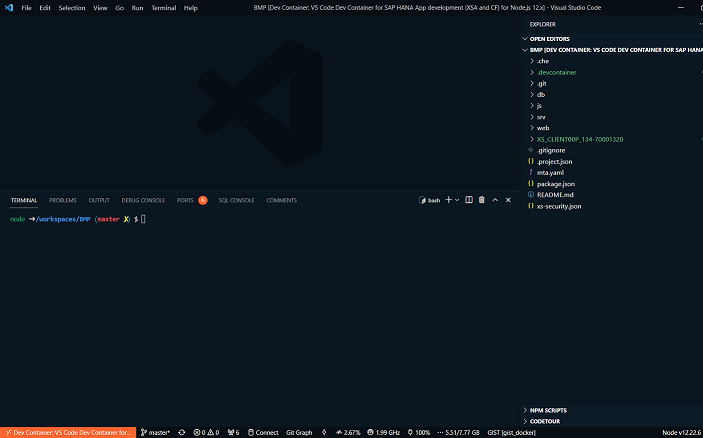
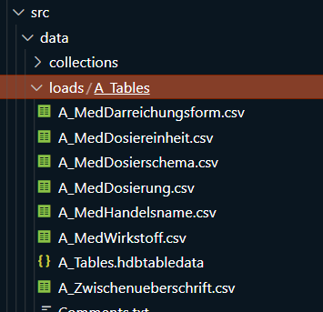
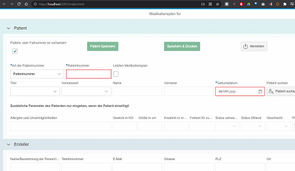

# Develop and deploy the repository BMP (Bundeseinheitlicher Medikationsplan) on your local System with VS Code to a SAP HANA XSA

In this exercise I will show how to set up a local dev environment for the node.js app [BMP](https://github.com/draschke/BMP.git).

You can follow all my steps with this [VS Dev Container for Node.js 12x](https://draschke.github.io/vsc-sap-hana-mta-dev-env-node12x/)

Be aware that I don't use Docker Desktop anymore. [Docker on Windows (WSL) without Docker Desktop](https://dev.to/bowmanjd/install-docker-on-windows-wsl-without-docker-desktop-34m9)

## Preparations

- Use [VS Dev Container Nodejs12x](https://draschke.github.io/vsc-sap-hana-mta-dev-env-node12x/) and ***no additional installations*** are necessary for this exercise!
- You need the [XS Client](https://draschke.github.io/vsc-sap-hana-mta-dev-env-node12x/#xs-client-for-sap-hana-xsa-only-required-for-connecting-a-xsa-platform) for XSA deployment.
- Clone this repo [BMP](https://github.com/draschke/BMP.git) in a directory of your choice

### SAP HANA Document Store (DocStore)

- For this project you have to enable the [DocStore](https://help.sap.com/viewer/4505d0bdaf4948449b7f7379d24d0f0d/2.0.05/en-US/3872240967ec4e4ea030524985dac73b.html) in your HANA System

```sql
ALTER DATABASE <database name> ADD 'docstore'
```  

### SAP HANA Cloud Document Store (DocStore)

If you like to try this project on SCP, it won't work if you use only a trial-account. More information you'll find here: [How to enable docstore on SAP HANA Cloud?](https://answers.sap.com/questions/13207475/how-to-enable-docstore-on-sap-hana-cloud.html)

## Set up for VS Code Dev Container (As you can see, we are inside of a VS Dev Container. It includes everything we need.)



## Let's start

### Step 1: Login to your space

```bash
node ➜ .../BMP (master ✗)
$ xs login -a https:// -u user -p psw -s space --skip-ssl-validation
```

### Step 2: Check for your node.js runtime environment

This project requires 12.x

```bash
node ➜ .../BMP (master ✗)
$ xs runtimes
type                  version   id   resolved   active   description                                    bound apps
------------------------------------------------------------------------------------------------------------------
node12.20             0.0       31   true       true     Node.js 12.20.0 for Linux x86-64               15
```

### Step 3: Install npm module

```bash
node ➜ .../BMP (master ✗)
node ➜ .../BMP (master ✗) $ npm i
node ➜ .../BMP (master ✗) $ npm audit fix
```

In order to set up a fast local development environment for our project, it is the best to deploy the mtar file at first. Because all of the required programs are already installed (if you used this devcontainer) you can build the .mtar file manually.

### Step 4: Build and Deploy the .mtar file

Build the .mtar file.

```bash
node ➜ .../BMP (master ✗)
$ mbt build -t ./

output:
INFO the MTA archive generated at: BMP_1.0.5.mtar
INFO cleaning temporary files...
```

If everything went well, you will find the BMP_x.mtar file in your project.

Deploy the mtar file.

```bash
node ➜ .../BMP (master ✗)
$ xs deploy BMP_1.0.5.mtar --use-namespaces
...
Process finished.
```

The cool thing is that you do not need to create and bind the services manually, everything happens automatically, because the information is described within the mta.yaml file.

New created services

- name: bmp-uaa
- name: hdi-bmp-db

Step 5: Look to the apps

```bash
node ➜ .../BMP
$ xs a
name         requested state   instances   memory    disk          alerts   urls
------------------------------------------------------------------------------------------------------------------------------
BMP.db       STOPPED           0/1         128 MB    256 MB                 <none>
BMP.js       STARTED           1/1         128 MB    512 MB                 https://orgname-dev-js.host.domain.com
BMP.web      STARTED           1/1         1.00 GB   512 MB                 https://orgname-dev-web.host.domain.com
```

If the BMP.js and the BMP.web apps are running (1/1) we can move forward and look to the new created services.

Step 6: Look to the binding and the status of the services
Here you will see the binding of the uaa service on your XSA system. This is what we need locally for our dev environment.

```bash
node ➜ .../BMP (master ✗)
$ xs service BMP.bmp-uaa
Service instance:   BMP.bmp-uaa
Service:            xsuaa
Bound apps:         BMP.js, BMP.web
Status:             succeeded
```

```bash
node ➜ .../BMP (master ✗)
$ xs service BMP.hdi-bmp-db
Service instance:   BMP.hdi-bmp-db
Service:            hana
Bound apps:         BMP.db, BMP.js
Status:             succeeded
```

Everything looks good, let's get the environment variables.

Step 7: Go to db app and fetch the env variables for "BMP.db"

```bash
node ➜ .../BMP (master ✗) $ cd db
node ➜ .../BMP/db (master ✗) $ xs env BMP.db > envBMPdb.json
node ➜ .../BMP/db (master ✗) $ cp envBMPdb.json default-env.json
```

Go to the file db/default-env.json and remove everything outside the system-provided brackets {}.
Now let's test the connection.

Step 7: Check the connection: hana-cli status

```bash
node ➜ .../BMP/db (master ✗) 
$ hana-cli status
Using Connection Configuration loaded via default-env.json 
Current User                                                   Current Schema                  
-------------------------------------------------------------  --------------------------------
0C68B8C61AD14EBA8AB46B47B327C5D0_BQU7KHCUERIJZBWR6E0AH0R9Y_RT  0C68B8C61AD14EBA8AB46B47B327C5D0
```

Great, it works!
Next, let's look at the tables

Step 7: Check for the tables

```bash
node ➜ .../BMP/db (master ✗) $ hana-cli tables
Using Connection Configuration loaded via default-env.json 

SCHEMA_NAME                       TABLE_NAME                          TABLE_OID  COMMENTS
--------------------------------  ----------------------------------  ---------  --------
0C68B8C61AD14EBA8AB46B47B327C5D0  A_Ersteller                         51325720   null
0C68B8C61AD14EBA8AB46B47B327C5D0  A_MedDarreichungsform               51325734   null
0C68B8C61AD14EBA8AB46B47B327C5D0  A_MedDosiereinheit                  51325742   null
0C68B8C61AD14EBA8AB46B47B327C5D0  A_MedDosierung                      51325749   null
0C68B8C61AD14EBA8AB46B47B327C5D0  A_MedHandelsname                    51325758   null
0C68B8C61AD14EBA8AB46B47B327C5D0  A_MedWirkstoff                      51325767   null
0C68B8C61AD14EBA8AB46B47B327C5D0  A_Zwischenueberschrift              51325774   null
```

Step 7: Check for the data of tables

Yes, this project contains required data for some tables, which were added with the deployment.

```bash
node ➜ .../BMP/db (master ✗) 
$ hana-cli qs -o "table" -q 'SELECT TOP 10 * FROM "A_MedWirkstoff"'
Using Connection Configuration loaded via default-env.json 

BezeichnungID  Bezeichnung                                    
-------------  -----------------------------------------------
1              (3-sn-Phosphatidyl)cholin                      
2              2,3-Dimercapto-1-propansulfonsäure, Natriumsalz
3              4-Aminomethylbenzoesäure                       
4              4-Aminosalicylsäure                            
5              4-Dimethylaminophenol                          
6              Abacavir                                       
7              Abatacept                                      
8              Abciximab                                      
9              Acarbose                                       
10             Acebutolol     
```

You will find the csv files here.



Step 7: Install the npm modul - npm i

```bash
node ➜ .../BMP/db (master ✗) $ npm i
```

Step 7: Run your deployment locally - npm run start

```bash
node ➜ .../BMP/db (master ✗) $ npm run start
> deploy@ start .../BMP/db
> node node_modules/@sap/hdi-deploy/deploy.js  --auto-undeploy
Working ...
@sap/hdi-deploy, version 4.2.0 (mode default), server version 2.00.051.00.1596053985 (2.0.51.0), node version 12.22.6, HDI version 4, container API version 44
Deployment started at 2021-10-01 11:26:36
...
Deployment ended at 2021-10-01 11:27:29
(89s 575ms)
Application can be stopped.
```

## ``BMP.js`` app

Step 7: Fetch env variables for app ``BMP.js``

```bash
node ➜ .../BMP (master ✗) $ cd js
node ➜ .../BMP/js (master ✗) $ xs env BMP.js > envBMPjs.json
node ➜ .../BMP/js (master ✗) $ cp envBMPjs.json default-env.json
```

As we have done it before, go to the file js/default-env.json and remove everything outside of the system-provided brackets {}.

Step 7: Install the npm modul - npm i

```bash
node ➜ .../BMP/js (master ✗) 
$ npm i
$ npm audit fix
```

Step 7: Run your app locally - npm run start

```bash
node ➜ .../BMP/js (master ✗) $ npm run start

> js@1.0.0 start .../BMP/js
> node server.js

==============================================
Server running at port 3000
==============================================
```

Nice, the server is running and waiting. Now we ready to go to the web app.

## ``BMP.web`` app

Step 7: Fetch env variables for app ``BMP.web``

```bash
node ➜ .../BMP (master ✗) $ cd web
node ➜ .../BMP/web (master ✗) $ xs env BMP.web > envBMPweb.json
node ➜ .../BMP/web (master ✗) $ cp envBMPweb.json default-env.json
```

Again, go to the file js/default-env.json and remove everything outside of the system-provided brackets {}.
But this time we have a bit more to do, because we need also the user provided variables.

```bash
  "destinations": [
    {
      "name": "nodejs_destination",
      "url": "http://localhost:3000",
      "forwardAuthToken": true,
      "strictSSL": false
    }
  ],
  "SESSION_TIMEOUT": 30,
  "ui5liburl": "https://orgname-sap-sapui5-fesv4.host.domain.com",
  "XS_APP_LOG_LEVEL": "error",
   "VCAP_APPLICATION": {...
   },
  "VCAP_SERVICES": {
    "xsuaa": [  {}   ]
```

Step 7: Install the npm modul - npm i

```bash
node ➜ .../BMP/web (master ✗) 
$ npm i
$ npm audit fix
```

Step 7: Start the web app - npm run start

If everything went fine, you are able to start the app by running npm run start

```bash
node ➜ .../BMP/web (master ✗) 
$ npm run start
```



### Issues

Issue: login/callback

If we set the authenticationMethod on "route" we will run in a login/callback issue. Not sure, if this is a proxy or an SSL issue.
The property strictSSL should fix the issue, but doesn't work.

```json
default-env.json
"strictSSL": false
```

```json
xs-security.json
"authenticationMethod": "none" --> "authenticationMethod": "route"
```

```bash
Request URL: http://localhost:5001/login/callback?code=xEbrAeOtuW
Request Method: GET
Status Code: 500 Internal Server Error
Remote Address: 127.0.0.1:5001
Referrer Policy: strict-origin-when-cross-origin
```

Also, setting the oauth2-configuration does not fix the issue.

```bash
xs update-service BMP.bmp-uaa  -c xs-security.json
```

```json
"oauth2-configuration": {
      "redirect-uris": [
          "http://localhost:5000"
      ]
  }
```
