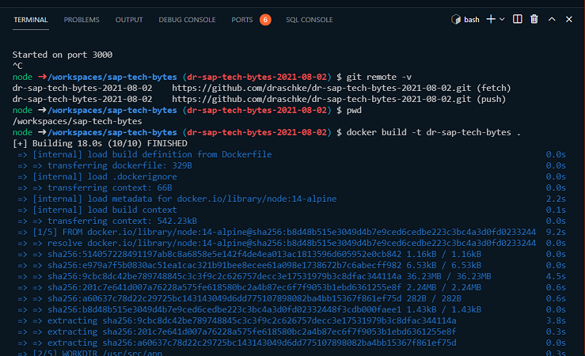
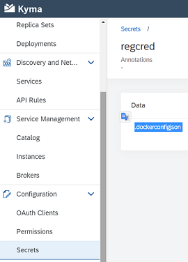
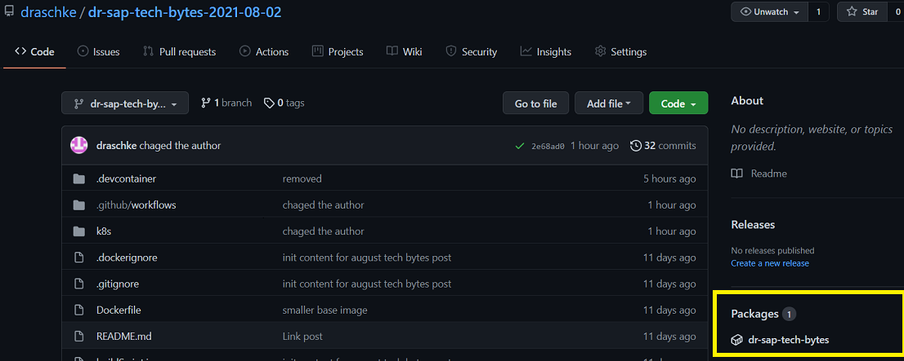
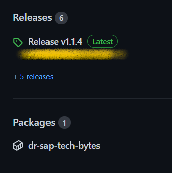

# Using GitHub Actions to Deploy Continuously to Kyma/Kubernetes

- [Using GitHub Actions to Deploy Continuously to Kyma/Kubernetes](https://blogs.sap.com/2021/08/02/sap-tech-bytes-using-github-actions-to-deploy-continuously-to-kyma-kubernetes/?source=social-Global-sap-developers-LINKEDIN_COMPANY-MarketingCampaign-Developers-Business+Technology+Platform+Umbrella-spr-5262938156&campaigncode=CRM-XB21-MKT-DGEALL) with this [VS Dev Container](https://github.com/draschke/dr-sap-tech-bytes-2021-08-02/blob/b108204e237e3c48998ab65a20cc5026afe36b9c/.devcontainer)

- If you use this [VS Dev Container](https://github.com/draschke/dr-sap-tech-bytes-2021-08-02/blob/b108204e237e3c48998ab65a20cc5026afe36b9c/.devcontainer) you can follow all the steps without having to install any further program. This walkthrough only provides my additional quidance for this awesome tutorial from Marius Obert.

## Preparations

- Clone this [repo](https://github.com/draschke/dr-sap-tech-bytes-2021-08-02.git) in a new WSL folder and start the included Dev Container

## Dockerize the App

```bash
node ➜ /workspaces/sap-tech-bytes (2021-08-02-github-actions-kyma)
$ docker build -t sap-tech-bytes .
```



- Tag the image with your registry account user

```bash
node ➜ /workspaces/sap-tech-bytes (2021-08-02-github-actions-kyma) 
$ docker tag dr-sap-tech-bytes:latest draschke/dr-sap-tech-bytes

output--> draschke/dr-sap-tech-bytes:latest
```


## Update your .kube/config

- Update your .kube/config (after 8 hours you will have to change it again)

```bash
 cp .\kubeconfig.yaml  ~/.kube/config
 #find your directory here
\\wsl$\Ubuntu-20.04\home\<youruser>\.kube
```

- or do it better and follow this nice guide from Marius [Create a Kyma service account](https://developers.sap.com/tutorials/kyma-create-service-account.html)

## The Kyma Manifest

- Make sure you are logged in to kubectl by running one of this commands

```bash
node ➜ /workspaces/sap-tech-bytes (2021-08-02-github-actions-kyma)
$ kubectl get ns
$ kubectl get pods
```

- Change the dev_deployment.yaml
  
```bash
#image: ghcr.io/<user>/<repo name>:latest
```

- Create secret “regcred“ (Take care that you have a namespace "tutorial")
  
```bash
node ➜ /workspaces/sap-tech-bytes (2021-08-02-github-actions-kyma)

$ kubectl -n tutorial create secret docker-registry regcred --docker-server=https://ghcr.io  --docker-username=<github user>  --docker-password=<github personal access token>
```

- After creating the secret "regcred" you'll find it here



## Set up the GitHub Repository

- Go to your kubeconfig.yml and export a base64 value file and paste it to your git repository secrets

```bash
\\wsl$\Ubuntu-20.04\home\<user>\.kube\kubeconfig.yml
cat kubeconfig.yaml | base64 > base64-kubeconfig.txt
```

- Create a repo secret ``DEV_KUBECONFIG``  with the base64 value


## Create Two GitHub Workflows

- Change the name of your image

```bash
.github/workflows/deploy.yaml
  IMAGE_NAME: sap-samples/tech-bytes-kyma-cicd
```

- You need your GITHUB_TOKEN

```bash
password: ${{ secrets.GITHUB_TOKEN }}
```

- You need your DEV_KUBECONFIG

```bash
 config: ${{ secrets.DEV_KUBECONFIG }}
```

## This is what happen when you trigger the deployment.yaml file (.github/workflows/deploy.yaml)

  1. Load metadata from the Dockerfile
  2. Build the image
  3. Push the image to the registry
  4. Read the kubeconfig from the secret we created and deploy the image to your Kyma cluster.

- Packages on the right side



- Check if your app is running (If not keep an eye at your Pods (error logs / credentials))


## Trigger the Pipeline

- Increase the version

```bash
node ➜ /workspaces/sap-tech-bytes (dr-sap-tech-bytes-2021-08-02) 
$ npm version patch
v1.1.3 
node ➜ /workspaces/sap-tech-bytes (dr-sap-tech-bytes-2021-08-02) 
$ git push --follow-tags
...
 * [new tag]         v1.1.3 -> v1.1.3
```

```bash
Have had this issue: 
node ➜ /workspaces/sap-tech-bytes (dr-sap-tech-bytes-2021-08-02 ✗) 
$ npm version patch 
Output #npm ERR! Git working directory not clean.
```

```bash
Solution:
node ➜ /workspaces/sap-tech-bytes (dr-sap-tech-bytes-2021-08-02 ✗) 
$ npm version --no-git-tag-version
After that you should be fine
```

- Update the current deployment to make use of the latest image

The [publish.yaml file](https://github.com/draschke/dr-sap-tech-bytes-2021-08-02/blob/85a1177577c438b1e23d7a7b96ab5e34eb3638b7/.github/workflows/publish.yaml) includes a nice Action to keep your releases updated



## Kudos to Marius Obert for this great technical article
